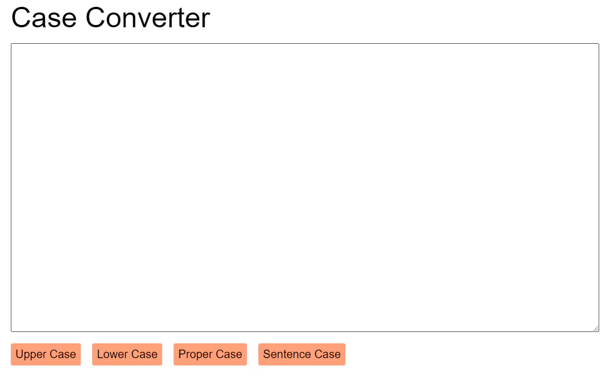
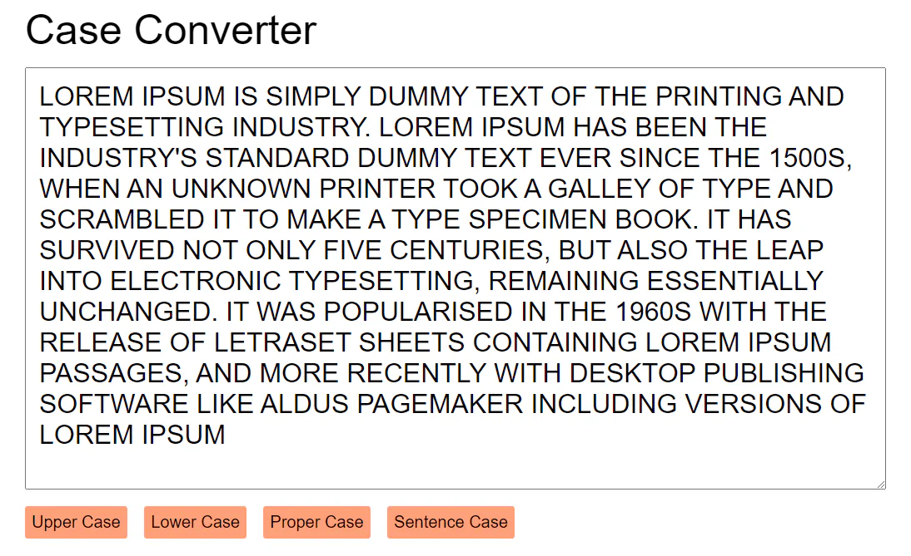
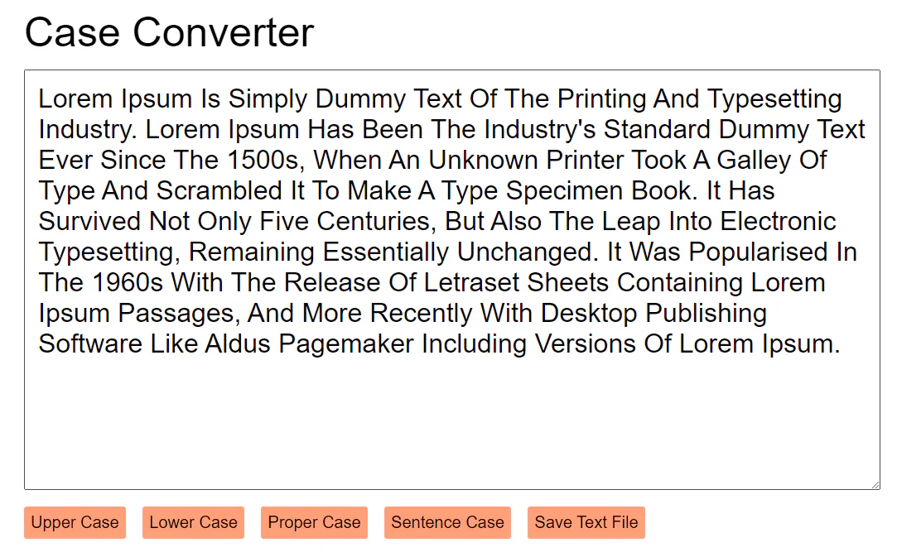

# case converter

- [case converter](#case-converter)
  - [learning](#learning)
  - [about](#about)
  - [stages](#stages)
    - [1: the converter](#1-the-converter)
    - [2: upper or lower](#2-upper-or-lower)
    - [3: save me](#3-save-me)

## learnings
while implementing this project, you will work with basic html elements. create event handlers for click events and work with strings in javascript. find out how to generate files for downloading.

## about
we work with texts quite often, and it's very sad when it turns out that the text should have been written in a different case. instead of editing it, you can create a simple application that does the job for us.

### 1: the converter 
<details>
<summary>design the application page. create the textarea element, buttons, and styles.</summary>

#### 1.1 description
imagine you have to write a long piece of text, and then suddenly, it needs to be in uppercase or lowercase. do you have to rewrite it all? no! let's create a tool to change the case automatically. we'll start by adding some html elements.

#### 1.2 objectives
in this stage, your web page should contain the following html elements:
- a `div` block with the class `title` containing the text "case converter";
- a `textarea` element. it should be empty by default;
- a `button` element with the `upper-case` id;
- a `button` element with the `lower-case` id;
- a `button` element with the `proper-case` id;
- a `button` element with the `sentence-case` id.

we will implement the functionality behind the buttons in the next stages.

### 1.3 examples
example 1: an example of your app



</details>

### 2: upper or lower
<details>
<summary>add handlers for buttons and change the text case accordingly.</summary>

#### 2.1 description
let's work with the text in the `textarea` element by adding button handlers. your application should convert text to uppercase, lowercase, proper case, and sentence case.

your application should be able to convert a text into the **upper case**, **lower case**, **proper case**, and **sentence case**.
- **upper case**: all letters are uppercase (e.g., THIS IS UPPERCASE TEXT).
- **lower case**: all letters are lowercase (e.g., this is lowercase text).
- **proper case**: each word starts with an uppercase letter, and the rest are lowercase (e.g., This Is Proper Case Text).
- **sentence case**: each sentence starts with an uppercase letter, and the rest are lowercase (e.g., This is sentence case. Only the first word of each sentence is capitalized).

**tip**: this stage requires knowledge of various string methods. you can take a look at the string methods like `join()`, `charat()`, `split()`, `slice()`. if you're using the `split()` method, double-check your separator for different cases. also, for the sentence case notice that there is an empty character after the dot.

#### 2.2 objectives
your web page should contain all elements from the previous stage.

add the following event handlers to the buttons:
- when the `upper-case` button is pressed, convert the textarea text to uppercase.
- when the `lower-case` button is pressed, convert the textarea text to lowercase.
- when the `proper-case` button is pressed, convert the textarea text to proper case.
- when the `sentence-case` button is pressed, convert the textarea text to sentence case.

#### 2.3 examples
**example 1**: *an example of your app*



</details>

### 3: save me
<details>
<summary>save the edited text as a .txt file. generate and download it in the browser.</summary>

#### 3.1 description
you can convert the text into different cases, excellent! now let's add the ability to save the changed text as a `.txt` file!

#### 3.2 objectives
add one more button to the page. assign the `save-text-file` id to it. add another event handler for the button.

when the button is clicked, you should get the text in the [textarea element](https://developer.mozilla.org/en-US/docs/Web/HTML/Element/textarea) and generate the `text.txt` file. the resulting file should contain the text from the `textarea` element.

here is a code snippet that shows how you can implement it:

```js
function download(filename, text) {
  let element = document.createElement('a');
  element.setAttribute('href', 'data:text/plain;charset=utf-8,' + encodeURIComponent(text));
  element.setAttribute('download', filename);

  element.style.display = 'none';
  document.body.appendChild(element);

  element.click();

  document.body.removeChild(element);
}

// Start file download.
download("hello.txt","This is the content of my file :)");
```

#### 3.3 examples
**example 1**: *an example of your app*



</details>

[<<](https://github.com/eucarizan/front-end/blob/main/README.md)

<!--
:%s/\(Sample \(Input\|Output\) \d:\)\n\(.*\)/```\r\r**\1**\r```\3/gc

### 0: 
<details>
<summary></summary>

#### 0.1 description

#### 0.2 objectives

#### 0.3 examples

</details>
-->

