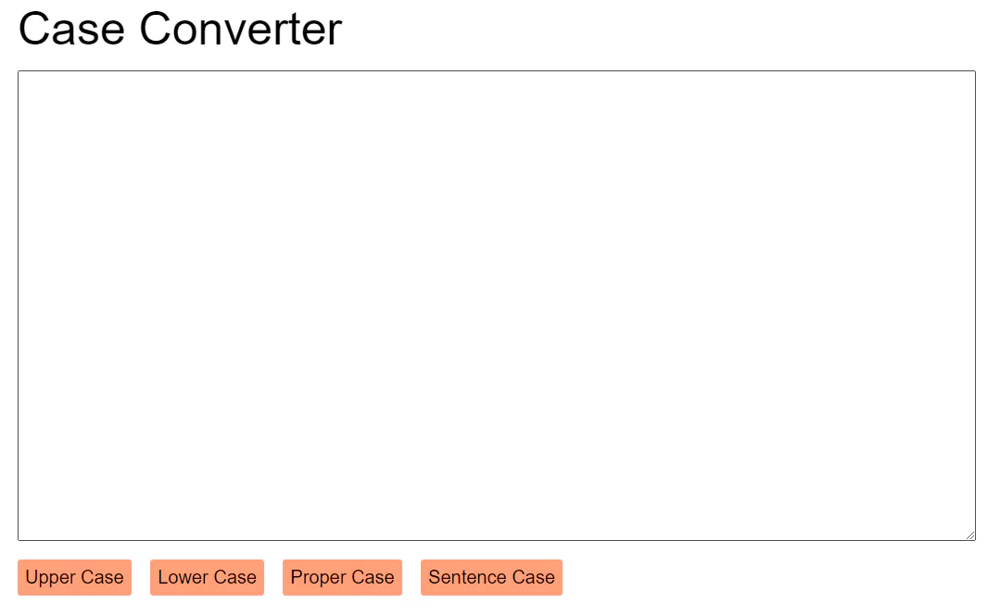

# case converter

- [case converter](#case-converter)
  - [learning](#learning)
  - [about](#about)
  - [stages](#stages)
    - [the converter](#the-converter)

## learnings
while implementing this project, you will work with basic html elements. create event handlers for click events and work with strings in javascript. find out how to generate files for downloading.

## about
we work with texts quite often, and it's very sad when it turns out that the text should have been written in a different case. instead of editing it, you can create a simple application that does the job for us.

### the converter 
<details>
<summary>design the application page. create the textarea element, buttons, and styles.</summary>

### description
imagine you have to write a long piece of text, and then suddenly, it needs to be in uppercase or lowercase. do you have to rewrite it all? no! let's create a tool to change the case automatically. we'll start by adding some html elements.

### objectives
in this stage, your web page should contain the following html elements:
- a `div` block with the class `title` containing the text "case converter";
- a `textarea` element. it should be empty by default;
- a `button` element with the `upper-case` id;
- a `button` element with the `lower-case` id;
- a `button` element with the `proper-case` id;
- a `button` element with the `sentence-case` id.

we will implement the functionality behind the buttons in the next stages.

### examples
example 1: an example of your app



</details>

[<<](https://github.com/eucarizan/front-end/blob/main/README.md)

<!--
:%s/\(Sample \(Input\|Output\) \d:\)\n\(.*\)/```\r\r**\1**\r```\3/gc
<details>
<summary></summary>

## 
### description

### solution

</details>
-->

